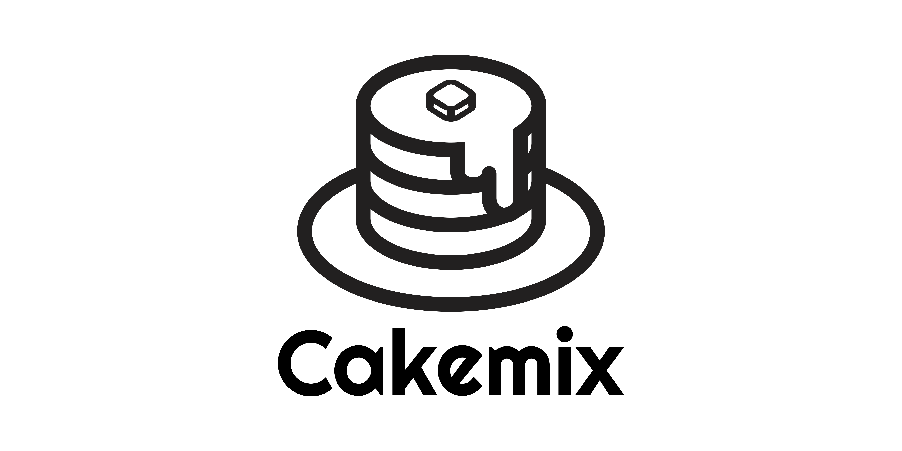

# Cakemix

<!--  -->

Cakemix is opensource document management system for all creative team.  
You can make a small team, folder and document on the Cakemix, also write a document with markdown, and edit with multiple users in realtime.  

You can try [Cakemix DEMO](https://hotcakemix.com)

# Features

- [x] Opensource(MIT)
- [x] Write document with markdown
- [x] Edit document with multiple users in realtime
- [x] Make document folder
- [x] Make small team
- [x] Security
- [x] Support PWA
- [x] Support Mobile-Friendly Design

# Demo

You can try Cakemix DEMO from [HERE](https://hotcakemix.com)

# Developer

We are welcome to contribute to Cakemix!  

- ### [SERVER SIDE](https://github.com/wonder-wonder/cakemix-server)
- ### [FRONT SIDE](https://github.com/wonder-wonder/cakemix-front)

# License

**Released under the [MIT license](LICENSE)**